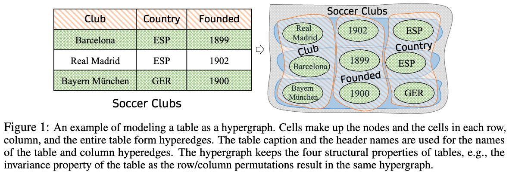

# HyTrel
A hypergraph-based tabular language model.

# Introduction
This repository contains the official implementation for the paper **HyTrel: Hypergraph-enhanced Tabular Data Representation Learning** with code, data, and checkpoints.



# Installation
It's recommended to use `python 3.9`.

Here is an example of creating the environment using [Anaconda](https://www.anaconda.com/). 
- Create the virtual environment using `conda create -n hytrel python=3.9`
- Install the required packages with the corresponding versions from `requirements.txt`

**Note**: If you encounter difficulty installing `torch_geometric`, please refer [here](https://pytorch-geometric.readthedocs.io/en/latest/install/installation.html) to install it according to your environment settings.

# Pretraining
-  Pre-process the raw data, slicing the big file into chunks, and put the `*.jsonl` files into the directory `/data/pretrain/chunks/`.\
  **Note**: Pretraining data `*.jsonl` are acquired and preprocessed by using the scripts from the [TaBERT](https://arrow.apache.org/docs/python/index.html).
 
- Run `python parallel_clean.py` to clean and serialize the tables. \
  **Note**: We serialize the tables as [arrow](https://arrow.apache.org/docs/python/index.html) in consideration of memory usage.
  
- Run `sh pretrain_electra.sh` to pretrain HyTrel with the [ELECTRA](https://arxiv.org/abs/2105.02584) objective.
  
- Run `sh pretrain_contrast.sh` to pretrain HyTrel with the Contrastive objective.


# Evaluation
## Column Type Annotation
- Put the data `{train, dev, test}.table_col_type.json` and `type_vocab.txt` into the directory `/data/col_ann/`
- Put the checkpoints to `/checkpoints/`
- Run `sh evaluate_cta.sh`

## Column Property Annotation
- Put the data `{train, dev, test}.table_col_type.json` and `type_vocab.txt` into the directory `/data/col_rel/`
- Put the checkpoints to `/checkpoints/`
- Run `sh evaluate_cpa.sh`

## Column Type Annotation
- Put the data `{train, dev, test}.table_col_type.json` and `type_vocab.txt` into the directory `/data/ttd/`
- Put the checkpoints to `/checkpoints/`
- Run `sh evaluate_ttd.sh`

# Load Checkpoints for Custom Data
To appear.

# Reference
Please cite our [paper](https://arxiv.org/pdf/2307.08623.pdf).


```text
@article{chen2023hytrel,
 archiveprefix = {arXiv},
 author = {Pei Chen and Soumajyoti Sarkar and Leonard Lausen and Balasubramaniam Srinivasan and Sheng Zha and Ruihong Huang and George Karypis},
 eprint = {2307.08623},
 primaryclass = {cs.LG},
 title = {HYTREL: Hypergraph-enhanced Tabular Data Representation Learning},
 year = {2023}
}
```
